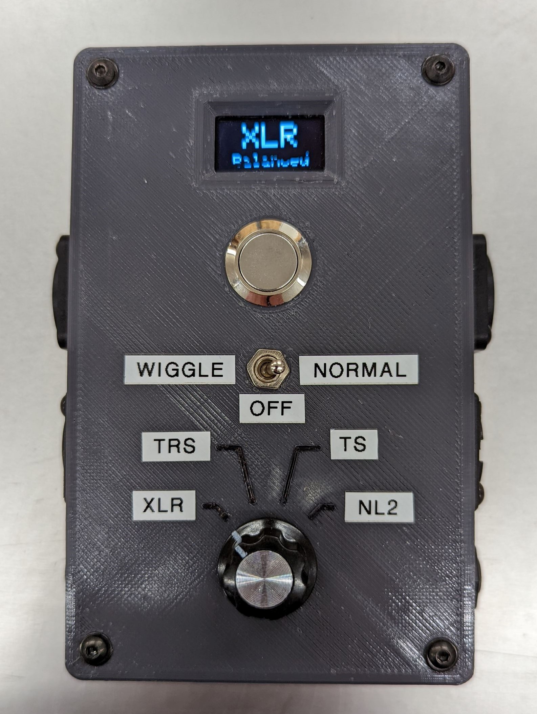
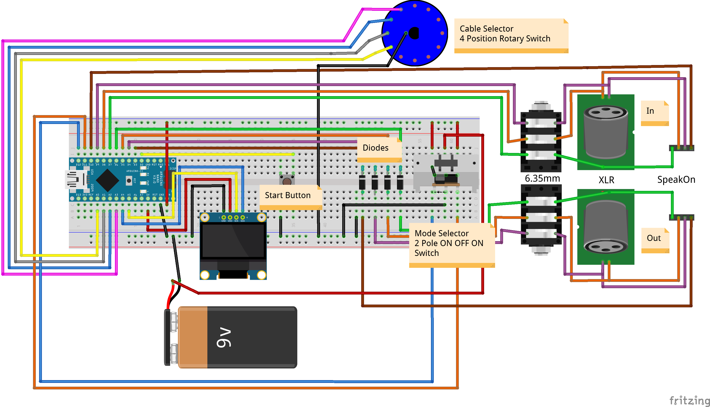

# Cable Tester
Inspired by [brodafins](https://www.youtube.com/channel/UCYWdkH3cT7uKhssbFg7uHtw) cable tester I decided to add my own twist to it and make a modified version.

If you would like to check out the original project you should watch his [youtube video](https://www.youtube.com/watch?v=r3Qzw2hiL2Y) and see how he built his unit.
His code can be found in the `brodafin` folder of this repository.

||||
|-|-|-|
|Front view|Input Side|Output Side|

Besides XLR and 1/4" cables I also use SpeakOn (PA speaker) Cables.
So I added the option to also test those cables (NL2 and NL4 only, I don't use NL8).

## Circuit Design

Take a look at the [fritzing file](cable-tester/schematics/schematics.fzz) if you need more details.

## 3D Printed Case
Feel free to download and print my case. Just make sure that your inputs / buttons match mine so that the holes will fit.
In case you want to modify it before printing, I have included my source files.

## Installing the Code
You should be able to just download my source code and flash it to your Arduino (Nano).
If you would like to use different pins for each in/output, the corresponding variables are all at the top of the file.

## Using the Tester
- First decide which mode (wiggle or normal) you would like to use. Flip the switch accordingly and wait ~2 seconds for everything to start up.
- Then connect your cable and select to proper setting using the rotary switch.
- After pressing the start button you will get your results. Either after the "wiggle period" is over or directly after testing.
- First a brief `FAIL` or `PASS` message will appear, after which the detailed test report will be displayed until you press the start button again.
- As an example, here's what a `passing` XLR cable will show:

| |2|3|1|/|
|-|-|-|-|-|
|2|X|O|O|O|
|3|O|X|O|O|
|1|O|O|X|O|
|/|O|O|O|O|

- The rows correspond to each pin on the output and the columns mark the inputs on the other side of the device.
`X` denotes a connection between the two pins and `O` means no connection.
- Take a look at my [cheat sheet](cable-tester/cheat_sheets/cheat_sheet.md) to see how each cable is expected to be wired up.